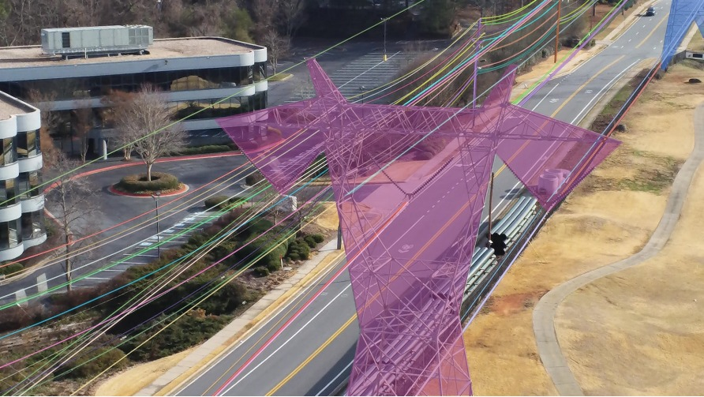
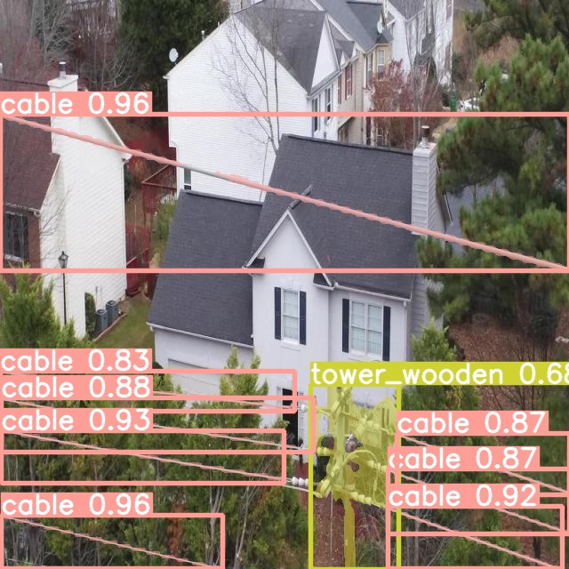
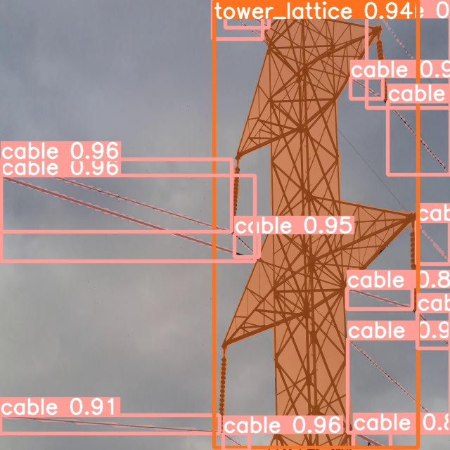
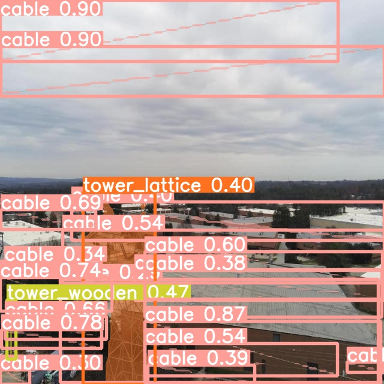
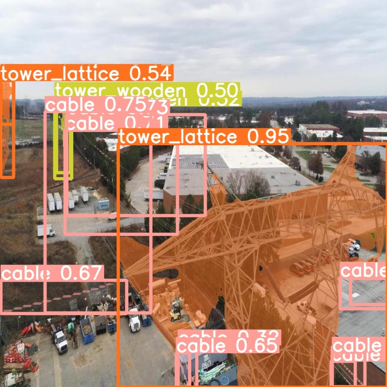
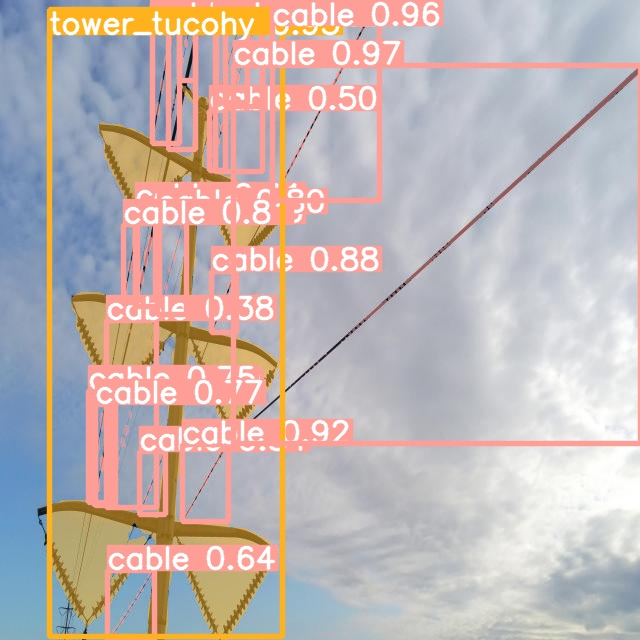
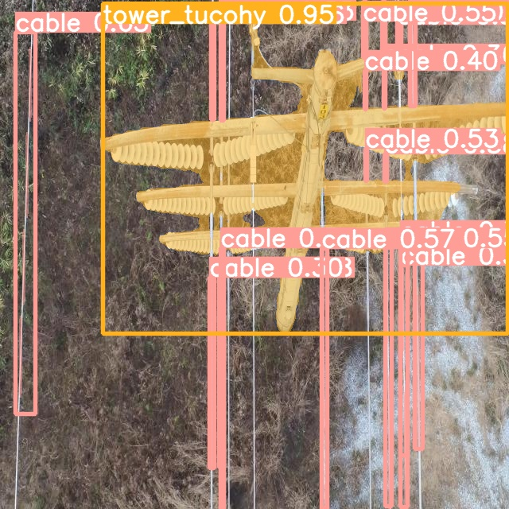

# Desafio Prático de Machine Learning
***
> Solução feita por Alysson Machado de Oliveira Barbosa

### Instruções do Desafio
***

1. Escreva um algoritmo em Python que realize o treinamento de um modelo para a detecção de torres de energia e linhas de energia em imagens.
2. Siga as instruções do repositório para extração de rótulos no formato [COCO dataset](https://cocodataset.org/#home). Utilize imagens de tamanho 640 x 360.
3. Respeite a divisão da base de dados quanto aos conjuntos de treino, validação e teste.
4. Atente-se a um código limpo, organizado, documentado e com ideias claras da solução proposta.
5. Caso mais de um modelo seja produzido, comente sobre os resultados obtidos, explicitando qual deles funcionou melhor e o porquê.
6. Na falta de uma GPU para o treinamento, recomenda-se o uso do Kaggle ou do Google Colab.


> Segmentação por instância de torres de energia e linhas de força.

## Abordagem do Problema
***

* ```Arquitetura Utilizada```: **YoloV8**.

A YOLOv8 é um modelo de rede neural utilizado para resolver problemas de segmentação por instância e detecção de objetos de forma simultânea. YOLO, que significa "*You Only Look Once*", é uma abordagem de detecção de objetos em tempo real que opera diretamente em uma imagem inteira, em vez de dividir a imagem em regiões menores, como outros métodos. O YOLOv8 é uma versão aprimorada que utiliza uma arquitetura de rede neural convolucional profunda para detectar e segmentar objetos em uma imagem, atribuindo rótulos e coordenadas de caixa delimitadora a cada objeto encontrado. Essa abordagem oferece uma detecção rápida e eficiente de objetos em tempo real, sendo amplamente utilizado em aplicações de vigilância, automação industrial, veículos autônomos e outras áreas onde a detecção de objetos é essencial.

* ```Servidor para treinar o modelo```: **Google Colab (GPU Tesla T4)**.

## Análise do Dataset
****

* ```Dataset utilizado```: [TTPLA: An Aerial-Image Dataset for Detection and Segmentation of Transmission Towers and Power Lines](https://github.com/R3ab/ttpla_dataset).

O dataset TTPLA contém imagens aéreas de torres e linhas de transmissão. Cada imagem possui anotações de segmentação poligonal dos objetos em análise, organizada em arquivos ```.json``` no formato [Coco Dataset](https://cocodataset.org/#home).

## Preparação dos Dados e Treinamento do Modelo

As etapas de preparação dos dados e treinamento do modelo estão disponívels no arquivo Jupyter Notebook:
* [desafio-icts-ttpla-dataset.ipynb](desafio-icts-ttpla-dataset.ipynb).

## Predição do Modelo Feita em Vídeos
***

A seguir, é possível analisar os resultados obtidos com a predição feita nos três vídeos selecionados. Os vídeos estão localizados na pasta ```resultados-videos/``` e também os coloquei no YouTube para maior facilidade de análise:

* Primeiro Vídeo: [https://youtu.be/QyB5Sq-Rt_A](https://youtu.be/QyB5Sq-Rt_A)
* Segundo Vídeo: [https://youtu.be/5booA-m-5Ns](https://youtu.be/5booA-m-5Ns)
* Terceiro Vídeo: [https://youtu.be/KNTggwp_2WI](https://youtu.be/KNTggwp_2WI)

## Predição Feita nas Imagens de Teste

#### 2. Imagens do Conjunto de Teste

A seguir, é possível visualizar o resultado de algumas imagens disponíveis no conjunto de teste. Mais imagens podem ser visualizadas na pasta ```resultados-teste/```.

|     |     |
| ----------- | ----------- |
|   |   |
|   |   |
|   |   |
